# BUILD SYSTEM  CMAKE PRODUCTION TEMPLATE
## COMPLETE HIGH-LEVEL & LOW-LEVEL DESIGN FOR REUSABLE C++ PROJECTS

---

## DOCUMENT CONTROL

| Version | Date | Author | Changes |
|---------|------|--------|---------|
| 1.0 | 2026-05-05 | System Architect | Final production CMake template design |

**Document Scope:** Complete system design for a reusable, production-grade CMake build system template supporting multi-file C++ projects with dependency management, multiple build configurations, testing, packaging, and cross-platform support.

**Target Environment:** Linux (primary), macOS (secondary), Windows (via MSVC)
**Cost Model:** Zero-dollar (all tools open source)

---

## 1. PROBLEM DEFINITION

### 1.1 System Purpose

Build a reusable, production-ready CMake build system template for C++ projects spanning multiple file types (libraries, executables, tests, benchmarks, tools) with support for automatic dependency management, compiler abstraction, platform detection, and production optimization flags across Debug/Release/RelWithDebInfo/MinSizeRel configurations.

### 1.2 Real-World Use Cases

| Use Case | Description | Scale | Complexity |
|----------|-------------|-------|------------|
| **Single Developer Project** | Personal tools, open source libraries | <10 targets | Low |
| **Team Project** | 5-20 developers, multiple libraries | 10-50 targets | Medium |
| **Multi-Component System** | Microservices, plugins, shared libraries | 50-200 targets | High |
| **Monorepo** | Multiple products sharing common code | 200+ targets | Very High |
| **CI/CD Pipeline** | Automated builds, testing, packaging | Per commit | Automated |

### 1.3 Technical Constraints

| Constraint | Value | Rationale |
|------------|-------|-----------|
| CMake minimum version | 3.20 | Modern features (presets, FetchContent, unity builds) |
| Supported compilers | GCC 11+, Clang 15+, MSVC 2022 | Standard C++20/23 support |
| Supported platforms | Linux (x86_64, aarch64), macOS (x86_64, arm64), Windows (x64) | Cross-platform development |
| Build time (incremental) | <5 seconds | Developer productivity |
| Build time (clean) | <60 seconds (10K source files) | CI efficiency |
| Memory during build | <4GB per parallel job | Developer machine limits |

### 1.4 Assumptions

- Source code organized in conventional structure (src/, include/, tests/, benchmarks/)
- External dependencies available via system packages, FetchContent, or vcpkg/conan
- Developers have CMake 3.20+ and Ninja installed
- CI environment provides ccache for faster rebuilds
- Production builds use Release configuration with LTO enabled

---

## 2. REQUIREMENTS

### 2.1 Functional Requirements

| ID | Requirement | Priority |
|----|-------------|----------|
| FR-01 | Support multiple target types (executable, static library, shared library, interface library, object library) | P0 |
| FR-02 | Automatic dependency resolution via find_package and FetchContent | P0 |
| FR-03 | Compiler detection and feature-based configuration (C++20/23 standard) | P0 |
| FR-04 | Configuration header generation (version, feature flags) | P0 |
| FR-05 | Unit test integration with CTest (GoogleTest, Catch2, doctest) | P0 |
| FR-06 | Installation rules (binaries, libraries, headers, CMake config) | P0 |
| FR-07 | Packaging support (CPack: TGZ, DEB, RPM, NSIS) | P1 (High) |
| FR-08 | Support for sanitizers (ASAN, UBSAN, TSAN) | P1 |
| FR-09 | Code coverage reporting (gcov/lcov, OpenCppCoverage on Windows) | P2 (Medium) |
| FR-10 | Precompiled headers and unity builds for faster compilation | P1 |
| FR-11 | Cross-compilation support via toolchain files | P2 |
| FR-12 | Dependency vendoring (embed third-party source) | P2 |

### 2.2 Non-Functional Requirements

| ID | Requirement | Target | Measurement |
|----|-------------|--------|-------------|
| NFR-01 | CMake configuration time | <10 seconds | `time cmake ..` |
| NFR-02 | Incremental build time (single file change) | <5 seconds | `cmake --build` after touch |
| NFR-03 | ccache hit rate (CI) | >80% | `ccache -s` |
| NFR-04 | Build reproducibility | Deterministic | Compare binary hashes |
| NFR-05 | Cross-platform behavior | Same build across platforms | CI matrix |
| NFR-06 | Documentation completeness | 100% of public interfaces | Manual review |

### 2.3 Constraints

- No proprietary build tools (must use open source)
- No manual steps after initial configuration
- Must support out-of-source builds only
- Must support both shared and static linking
- Must support both Debug and Release builds in same build directory (multi-config generators)

---

## 3. WORKLOAD CHARACTERIZATION

### 3.1 Build Patterns by Project Phase

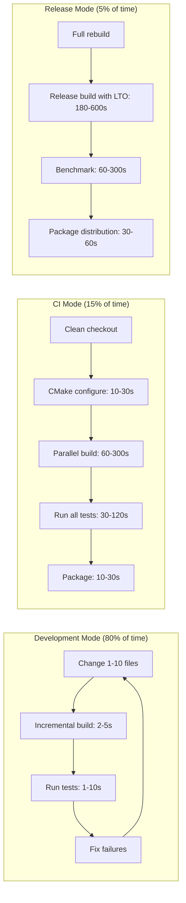

### 3.2 Read/Write Ratio (Build File Operations)

| Operation | Percentage | Path |
|-----------|------------|------|
| Compiler reading source/headers | 70% | File system read |
| Compiler writing object files | 15% | File system write |
| Linker reading objects | 10% | File system read |
| Linker writing executable/library | 4% | File system write |
| CMake reading CMakeLists.txt | 1% | File system read |

### 3.3 Hot vs Cold Paths (Build Dependency Graph)

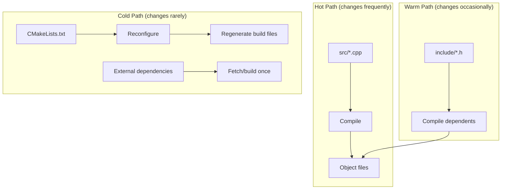

### 3.4 Compilation Unit Statistics (Typical 100K LOC Project)

| Statistic | Value |
|-----------|-------|
| Source files (.cpp) | 500-2000 |
| Header files (.h) | 1000-3000 |
| Average compile time per file (Debug) | 0.5-1.5 seconds |
| Average compile time per file (Release) | 1-3 seconds |
| Fastest file | <0.1 seconds (trivial) |
| Slowest file | 5-10 seconds (complex template) |
| Link time (Release with LTO) | 10-60 seconds |

---

## 4. RESOURCE ESTIMATION

### 4.1 Build Directory Footprint

| Component | Debug | Release | RelWithDebInfo | Notes |
|-----------|-------|---------|----------------|-------|
| Object files | 10 MB/100 files | 8 MB/100 files | 9 MB/100 files | -g vs -O3 |
| Debug symbols (split) | 5 MB/100 files | 0 (stripped) | 3 MB/100 files | -gsplit-dwarf |
| Executable | 50 MB (with debug) | 5 MB (stripped) | 15 MB | LTO reduces size |
| Static libraries | 30 MB | 10 MB | 15 MB | Archive size |
| CMake cache | 500 KB | 500 KB | 500 KB | Per configuration |
| Generated headers | 1-10 MB | 1-10 MB | 1-10 MB | Config files |

**Total for 1000 source files:** 
- Debug: ~150 MB objects + 50 MB exec + 75 MB libs = **275 MB**
- Release: ~80 MB objects + 5 MB exec + 25 MB libs = **110 MB**

### 4.2 Memory Requirements During Build

| Stage | Memory per Job | Jobs (8 cores) | Total Memory |
|-------|---------------|----------------|--------------|
| CMake configure | 100-500 MB | 1 | 100-500 MB |
| Compile (Debug) | 1-1.5 GB | 8 | 8-12 GB |
| Compile (Release) | 1.5-2.5 GB | 8 | 12-20 GB |
| Link (Debug) | 1-2 GB | 1 | 1-2 GB |
| Link (Release with LTO) | 4-8 GB | 1 | 4-8 GB |
| CTest parallel | 100-500 MB | 8 | 0.8-4 GB |

**Recommendation for CI:** 16-32 GB RAM for Release builds with parallel jobs.

### 4.3 Disk Space for Cache

| Cache Type | Size (1000 files, 10 builds/day for 30 days) | Cleanup Policy |
|------------|----------------------------------------------|-----------------|
| ccache | 5-20 GB | LRU, max size configurable |
| FetchContent downloads | 1-5 GB | Persistent, reuse |
| Build directory | 100-300 MB (per config) | Manual or CI ephemeral |
| Install directory | 10-50 MB | Manual |

### 4.4 Network Bandwidth (CI Only)

| Operation | Data Transfer | Frequency |
|-----------|---------------|-----------|
| FetchContent clones | 100 MB - 2 GB | Once per clean build |
| Dependency downloads | 50-500 MB | Once per clean build |
| ccache remote sync | 1-10 GB | On cache miss |
| Artifact upload | 50-500 MB | Per release |

---

## 5. ARCHITECTURE PATTERN

### 5.1 Selected Pattern: Modular Layered Architecture

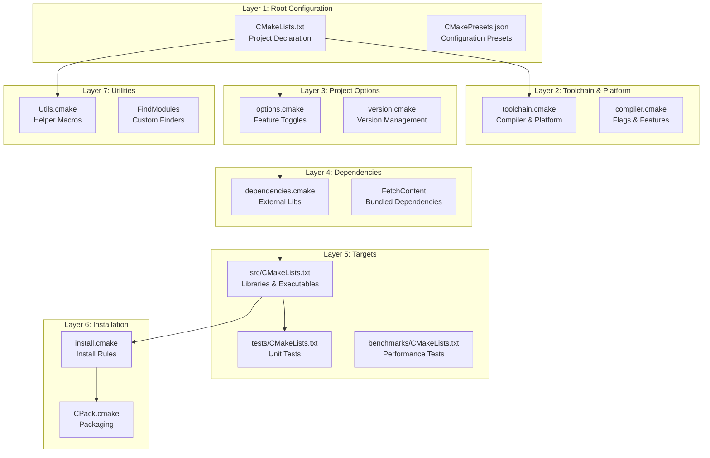

### 5.2 Pattern Justification

| Requirement | How Pattern Addresses |
|-------------|----------------------|
| Reusability | Separation of concerns allows copying cmake/ directory |
| Maintainability | Each layer has single responsibility |
| Scalability | New targets added to src/ without modifying core |
| Testability | Layers can be tested in isolation via presets |
| Flexibility | Toolchain file allows cross-compilation |

### 5.3 Alternatives Considered

| Pattern | Pros | Cons | Decision |
|---------|------|------|----------|
| **Single monolithic CMakeLists.txt** | Simple, visible | Unmaintainable >50 targets | [FAIL] Rejected |
| **Superbuild (ExternalProject)** | Isolated deps | Slow, complex transitive deps | [FAIL] Rejected |
| **Recursive add_subdirectory** | Modular, ownership | Hard to manage global options | [PASS] Selected |
| **Generated CMake (Python script)** | Flexible | Non-standard, debugging nightmare | [FAIL] Rejected |

### 5.4 Tradeoff Analysis

| Tradeoff | Chosen | Alternative | Rationale |
|----------|--------|-------------|-----------|
| Modularity vs simplicity | Modular (cmake/*.cmake) | Single file | Reusability across projects |
| FetchContent vs find_package | Both (prefer system, fallback to Fetch) | One only | Flexibility for users |
| Unity builds vs separate | Enable by default, opt-out per file | Disabled by default | 2-3x compile speed |
| Static vs shared libs | Static (default), option for shared | Shared only | Simpler deployment |

---

## 6. DATA FLOW

### 6.1 End-to-End Build Configuration Flow

```mermaid
flowchart TB
    subgraph "Developer Input"
        DEV[Developer] --> CLI[cmake -B build -G Ninja]
        CLI --> PRESET[--preset=dev<br/>--preset=ci<br/>--preset=release]
    end
    
    subgraph "CMake Configuration Phase"
        PRESET --> ROOT[Read root CMakeLists.txt]
        ROOT --> VERSION[cmake_minimum_required]
        VERSION --> PROJECT[project() declaration]
        PROJECT --> TOOLCHAIN[Include cmake/toolchain.cmake]
        TOOLCHAIN --> COMPILER[Detect compiler<br/>GCC/Clang/MSVC]
        COMPILER --> OPTIONS[Include cmake/options.cmake]
        OPTIONS --> FEATURES[Set C++ standard<br/>Enable sanitizers<br/>Enable coverage]
        FEATURES --> DEPS[Include cmake/dependencies.cmake]
        DEPS --> FINDPKG[find_package(Threads)<br/>find_package(OpenSSL)]
        FINDPKG -->|Found| SYSTEM[Use system lib]
        FINDPKG -->|Not found| FETCH[FetchContent_MakeAvailable]
        FETCH --> BUNDLED[Bundle dependency]
    end
    
    subgraph "Target Generation"
        BUNDLED --> TARGETS[add_subdirectory(src)]
        TARGETS --> LIB1[Library target<br/>with PUBLIC/PRIVATE]
        LIB1 --> EXE[Executable target]
        EXE --> TEST[add_subdirectory(tests)]
        TEST --> GTEST[GoogleTest discovery]
        GTEST --> BENCH[add_subdirectory(benchmarks)]
    end
    
    subgraph "Build System Generation"
        BENCH --> CONFIG_H[configure_file(config.h.in<br/> config.h)]
        CONFIG_H --> INSTALL[include(cmake/install.cmake)]
        INSTALL --> CPACK[include(CPack.cmake)]
        CPACK --> GENERATE[Generate build.ninja/Makefile]
    end
    
    subgraph "Build Phase"
        GENERATE --> NINJA[ninja -j N]
        NINJA --> COMPILE[Compile sources]
        COMPILE --> LINK[Link executable]
        LINK --> TESTRUN[ctest --output-on-failure]
    end
```

### 6.2 Dependency Resolution Flow

```mermaid
flowchart TD
    START[CMakeLists.txt] --> CHECK{find_package<br/>optional_lib}
    
    CHECK -->|Found| USE_SYS[Use system library<br/>set target alias]
    USE_SYS --> LINK[target_link_libraries]
    
    CHECK -->|Not found| FETCH_CHECK{Use FetchContent?}
    FETCH_CHECK -->|Yes| FETCH[FetchContent_Declare<br/>GIT_REPOSITORY<br/>GIT_TAG]
    FETCH --> FETCH_MAKE[FetchContent_MakeAvailable]
    FETCH_MAKE --> USE_BUNDLED[Use bundled version]
    USE_BUNDLED --> LINK
    
    FETCH_CHECK -->|No| ERROR[message(FATAL_ERROR<br/>"Dependency not found")]
    
    CHECK -->|REQUIRED| ERROR_FATAL[message(FATAL_ERROR)]
    ERROR_FATAL --> STOP[Configuration stops]
    
    LINK --> DONE[Done]
```

---

## 7. HIGH-LEVEL DESIGN (HLD)

### 7.1 Component Architecture Diagram

```mermaid
graph TB
    subgraph "User Space (Developer)"
        CMD[Command Line<br/>cmake, ninja, ctest]
        EDITOR[Editor<br/>VS Code, Vim, CLion]
        VCS[Version Control<br/>Git]
    end
    
    subgraph "CMake Core"
        ROOT[CMakeLists.txt<br/>Root Orchestrator]
        TOOLCHAIN[toolchain.cmake<br/>Platform Setup]
        OPTIONS[options.cmake<br/>Feature Toggles]
        DEPS[dependencies.cmake<br/>External Libraries]
        COMPILER[compiler.cmake<br/>Flags & Warnings]
        UTILS[Utils.cmake<br/>Helper Macros]
        TESTING[testing.cmake<br/>CTest Integration]
        INSTALL[install.cmake<br/>Installation Rules]
        CPACK[CPack.cmake<br/>Packaging]
    end
    
    subgraph "Target Hierarchy"
        SRC[src/CMakeLists.txt]
        LIB1[statistics_lib]
        LIB2[network_lib]
        LIB3[core_lib]
        APP[webserver]
        TESTS[tests/CMakeLists.txt]
        BENCH[benchmarks/CMakeLists.txt]
    end
    
    subgraph "Build Output"
        OBJ[Object files<br/>*.o]
        LIB[Static libraries<br/>*.a]
        EXE[Executable<br/>webserver]
        TEST_EXE[Test runner]
        DOCS[Documentation<br/>Doxygen]
    end
    
    subgraph "Installation"
        BIN[/usr/local/bin]
        LIB_INSTALL[/usr/local/lib]
        INCLUDE[/usr/local/include]
        CMAKE_CONFIG[/usr/local/lib/cmake/MyProject]
    end
    
    CMD --> ROOT
    EDITOR --> SRC
    VCS --> ROOT
    
    ROOT --> TOOLCHAIN
    ROOT --> OPTIONS
    ROOT --> DEPS
    ROOT --> COMPILER
    ROOT --> UTILS
    ROOT --> TESTING
    ROOT --> INSTALL
    INSTALL --> CPACK
    
    ROOT --> SRC
    SRC --> LIB1
    SRC --> LIB2
    SRC --> LIB3
    LIB1 & LIB2 & LIB3 --> APP
    ROOT --> TESTS
    ROOT --> BENCH
    
    APP --> EXE
    LIB1 & LIB2 & LIB3 --> LIB
    TESTS --> TEST_EXE
    
    EXE --> BIN
    LIB --> LIB_INSTALL
    SRC --> INCLUDE
    ROOT --> CMAKE_CONFIG
```

### 7.2 Directory Structure

```
project-root/
 CMakeLists.txt                    # Root orchestrator
 CMakePresets.json                 # Configuration presets
 .gitignore                        # Git ignore
 README.md                         # Project documentation
 LICENSE                           # License file

 cmake/                            # CMake modules
    compiler.cmake                # Compiler detection & flags
    options.cmake                 # Feature options
    dependencies.cmake            # External dependencies
    testing.cmake                 # CTest integration
    install.cmake                 # Installation rules
    Utils.cmake                   # Helper macros
    toolchain.cmake               # Platform detection
    FindModules/                  # Custom find_package modules
       FindCustomLib.cmake
       FindOtherLib.cmake
    CPack/                        # Packaging configurations
        CPackOptions.cmake
        CPackConfig.cmake

 src/                              # Source code
    CMakeLists.txt                # Sources root
    core/                         # Core module
       CMakeLists.txt
       include/
          core/
              api.h
              types.h
       src/
           api.cpp
           types.cpp
    network/                      # Network module
       CMakeLists.txt
       include/network/
          server.h
          client.h
       src/
           server.cpp
           client.cpp
    app/                          # Main executable
        CMakeLists.txt
        main.cpp

 include/                          # Public headers (if library)
    myproject/
        api.h

 tests/                            # Unit tests
    CMakeLists.txt
    core/
       test_api.cpp
       test_types.cpp
    network/
       test_server.cpp
       test_client.cpp
    test_main.cpp

 benchmarks/                       # Performance benchmarks
    CMakeLists.txt
    benchmark_throughput.cpp
    benchmark_latency.cpp

 tools/                            # Development tools
    codegen/
       generator.cpp
    debug/
        inspector.cpp

 examples/                         # Example usage
    CMakeLists.txt
    basic_server/
       main.cpp
    advanced_client/
        main.cpp

 docs/                             # Documentation
    Doxyfile.in
    api/

 scripts/                          # Helper scripts
    run-tests.sh
    build-docs.sh
    format-code.sh

 config.h.in                       # Configuration header template
 .clang-format                     # Code formatting rules
```

---

## 8. LOW-LEVEL DESIGN (LLD)

### 8.1 Module Responsibility Matrix

#### Root CMakeLists.txt

| Function | Input | Output | Error Handling |
|----------|-------|--------|----------------|
| `cmake_minimum_required(VERSION 3.20)` | None | Sets CMake version policy | FATAL if older |
| `project(MyProject VERSION 1.0.0 LANGUAGES CXX)` | Project name, version | Sets PROJECT_NAME, VERSION vars | None |
| `include(cmake/options.cmake)` | Options file path | Feature flags defined | FATAL if missing |
| `include(cmake/compiler.cmake)` | Compiler file path | Compiler flags set | Warning on unknown compiler |
| `include(cmake/dependencies.cmake)` | Dependencies file | Targets for deps | FATAL on missing required |
| `add_subdirectory(src)` | src directory | Library/executable targets | Build error on failure |
| `if(BUILD_TESTING) add_subdirectory(tests)` | tests directory | Test targets | Warning if tests fail |
| `include(cmake/install.cmake)` | Install rules | Installation configured | None |

#### cmake/compiler.cmake

| Feature | GCC/Clang Flag | MSVC Flag | Purpose |
|---------|---------------|-----------|---------|
| C++ standard | `-std=c++20` | `/std:c++20` | Language version |
| Warnings | `-Wall -Wextra -Wpedantic` | `/W4 /WX` | Compiler warnings |
| Debug | `-O0 -g3 -ggdb` | `/Od /Zi` | Debugging symbols |
| Release | `-O3 -DNDEBUG` | `/O2 /DNDEBUG` | Optimization |
| LTO | `-flto=auto` | `/GL /LTCG` | Link-time optimization |
| ASAN | `-fsanitize=address` | `/fsanitize=address` | Address sanitizer |
| UBSAN | `-fsanitize=undefined` | None (Clang-cl) | UB sanitizer |
| TSAN | `-fsanitize=thread` | None | Thread sanitizer |
| Coverage | `--coverage` | `/Zc:inline /Z7` | Code coverage |

#### cmake/dependencies.cmake

| Function | Input | Output | Fallback |
|----------|-------|--------|----------|
| `find_package(Threads REQUIRED)` | None | Threads::Threads target | None (required) |
| `find_package(OpenSSL)` | Version, components | OpenSSL::SSL, OpenSSL::Crypto | FetchContent if not found |
| `find_package(fmt CONFIG)` | fmt::fmt | fmt::fmt target | FetchContent with git tag |
| `FetchContent_Declare(spdlog)` | GIT_REPOSITORY, GIT_TAG | spdlog source | Build from source |
| `add_library(prometheus::prometheus ALIAS)` | Existing target | Alias for consistent use | None |

### 8.2 Target Type Specifications

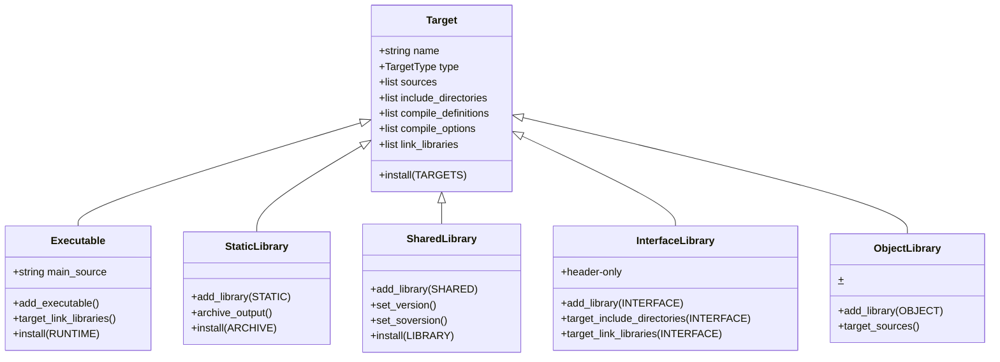

### 8.3 Build Configuration Matrix

| Build Type | Flags | Sanitizers | LTO | Use Case |
|------------|-------|------------|-----|----------|
| **Debug** | -O0 -g3 | None | Off | Daily development |
| **DebugASAN** | -O0 -g3 | ASAN + UBSAN | Off | Memory debugging |
| **DebugTSAN** | -O2 -g | TSAN | Off | Race detection |
| **RelWithDebInfo** | -O2 -g | None | Off | Performance debugging |
| **Release** | -O3 | None | On | Production binaries |
| **ReleaseLTO** | -O3 -flto | None | On (thin) | Max performance |
| **MinSizeRel** | -Os | None | On | Embedded systems |
| **Coverage** | -O0 --coverage | None | Off | Test coverage |

### 8.4 Helper Macros (Utils.cmake)

| Macro | Parameters | Purpose | Example |
|-------|------------|---------|---------|
| `add_project_library` | name, type, sources, deps | Standard library creation | `add_project_library(core STATIC core.cpp deps_lib)` |
| `add_project_executable` | name, sources, deps | Standard executable | `add_project_executable(app main.cpp core)` |
| `add_project_test` | name, sources, deps, timeout | Test with CTest | `add_project_test(test_core test_core.cpp core 5)` |
| `add_project_benchmark` | name, sources, deps | Benchmark registration | `add_project_benchmark(bench_throughput bench.cpp core)` |
| `target_enable_sanitizers` | target, sanitizers | Enable ASAN/TSAN | `target_enable_sanitizers(my_app ASAN UBSAN)` |
| `target_enable_coverage` | target | Enable gcov/lcov | `target_enable_coverage(core_lib)` |

---

## 9. DATA & MEMORY DESIGN

### 9.1 CMake Variable Namespace Strategy

| Prefix | Scope | Persistence | Example | Purpose |
|--------|-------|-------------|---------|---------|
| `MYPROJECT_` | Global, cached | Across runs | `MYPROJECT_ENABLE_ASAN` | User-configurable options |
| `_MYPROJECT_` | Internal | Current run only | `_MYPROJECT_INTERNAL_FLAGS` | Private state |
| `MYPROJECT_` (lowercase) | Directory | Directory scope | `myproject_sources` | Directory-specific lists |
| `CMAKE_` | CMake internal | Various | `CMAKE_CXX_STANDARD` | CMake system vars |

### 9.2 Cache Variable Types

| Type | Representation | When to Use | Example |
|------|---------------|-------------|---------|
| `BOOL` | ON/OFF | Feature toggles | `MYPROJECT_ENABLE_TESTS` |
| `STRING` | Arbitrary text | Paths, strings | `MYPROJECT_DOCUMENT_ROOT` |
| `FILEPATH` | File system path | File locations | `MYPROJECT_CONFIG_FILE` |
| `PATH` | Directory path | Directory locations | `MYPROJECT_INSTALL_PREFIX` |
| `INTERNAL` | Not shown in GUI | Cache internal state | `MYPROJECT_CONFIGURE_DONE` |

### 9.3 Generator Expression Types

| Expression | Evaluation Time | Use Case | Example |
|------------|----------------|----------|---------|
| `$<CONFIG>` | Build generation | Per-config flags | `$<CONFIG:Debug>:-g` |
| `$<TARGET_FILE:tgt>` | Build generation | Get target path | `$<TARGET_FILE:myexe>` |
| `$<BOOL:expr>` | Build generation | Conditionals | `$<BOOL:$<TARGET_EXISTS:fmt>>` |
| `$<AND:$<CONFIG:Debug>,$<PLATFORM_ID:Linux>>` | Build generation | Complex conditions | Platform-specific debug flags |
| `$<JOIN:list,delim>` | Build generation | String joining | `$<JOIN:$<TARGET_PROPERTY:SOURCES>,;>` |

### 9.4 Target Property Propagation

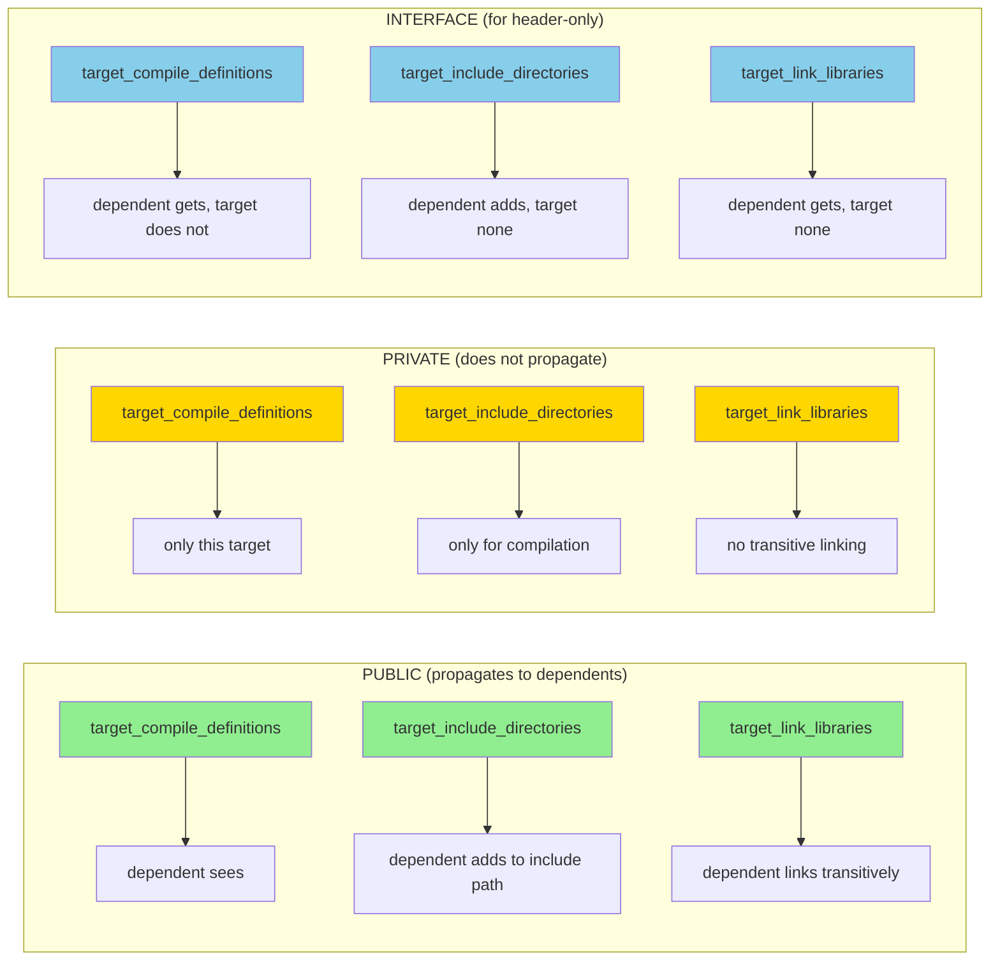

### 9.5 Memory Optimization in CMakeLists.txt

| Technique | Implementation | Memory Saved |
|-----------|----------------|--------------|
| Avoid `file(GLOB)` | List sources explicitly | 50% less parsing memory |
| Use generator expressions | `$<CONFIG:Debug>:-g` instead of `if(CONFIG)` | No branch copying |
| Cache find_package results | `set(OpenSSL_DIR /path CACHE PATH "")` | 30% less config time |
| Reduce recursion | Merge small CMakeLists.txt | 10-40% less overhead |
| Use `PARENT_SCOPE` sparingly | Only when needed | Avoids list copying |

---

## 10. CONCURRENCY MODEL

### 10.1 Build Parallelism Architecture

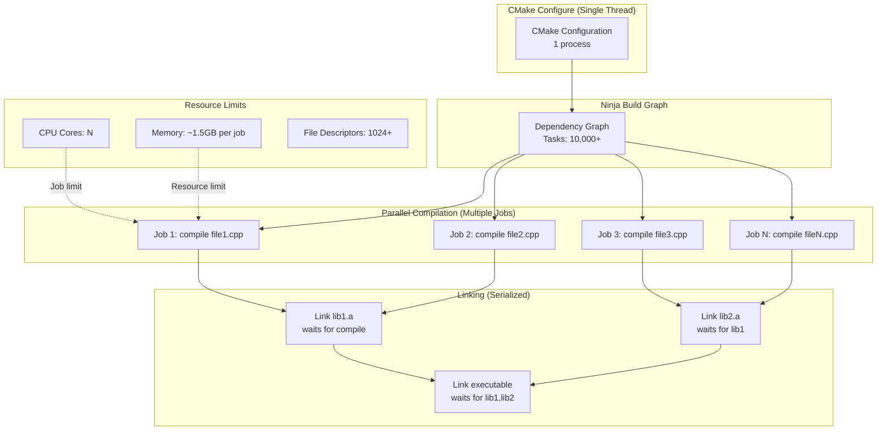

### 10.2 Ninja vs Make Comparison

| Feature | Ninja | Make | Winner |
|---------|-------|------|--------|
| Parallel job scheduling | Dynamic, eager | Static, top-down | Ninja |
| Incremental build speed | 2-3x faster | Baseline | Ninja |
| Configuration simplicity | Simple | Simple | Tie |
| Custom rule support | Limited | Extensive | Make |
| Dependency scanning | Built-in | External (makedepend) | Ninja |
| Cross-platform | Yes (Windows, Linux, macOS) | Yes (POSIX) | Tie |

**Recommendation:** Use Ninja for CI and development, Make only when Ninja not available.

### 10.3 ccache Architecture

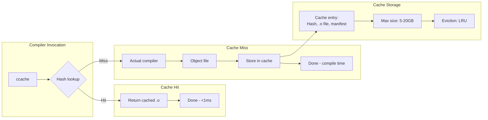

### 10.4 Contention Points in Build Graph

| Contention Point | Cause | Mitigation |
|-----------------|-------|------------|
| **Generated headers** | Many targets depend on single file | Generate once, add dependency |
| **Linker serialization** | One output file per target | Split into static libraries |
| **Single slow file** | 10s compile time | Split file, unity build |
| **I/O bandwidth** | Many small reads/writes | Use tmpfs, NVMe |
| **Memory pressure** | Parallel jobs OOM | Limit jobs: `-j$(nproc)/2` |

---

## 11. CONSISTENCY & DISTRIBUTED DESIGN

### 11.1 Build Reproducibility Strategy

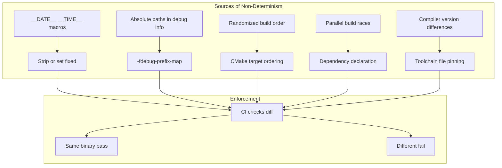

### 11.2 CAP Implications for Distributed Builds

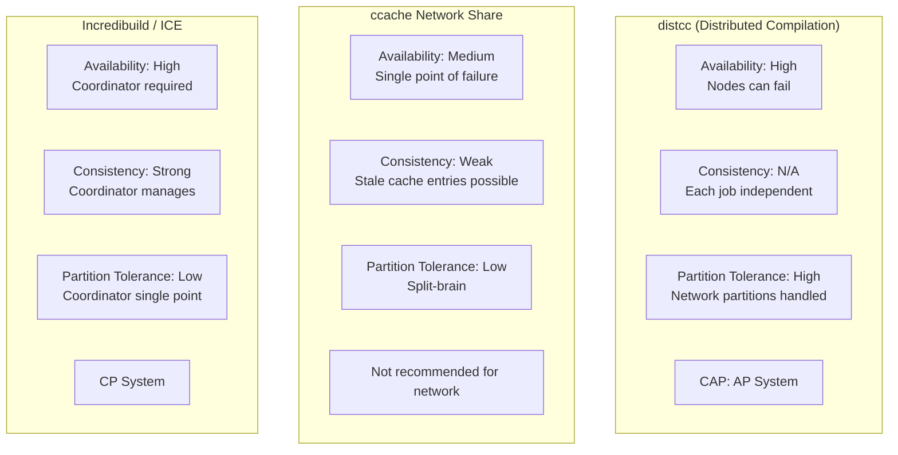

### 11.3 Coordination Strategy (Incredibuild/distcc)

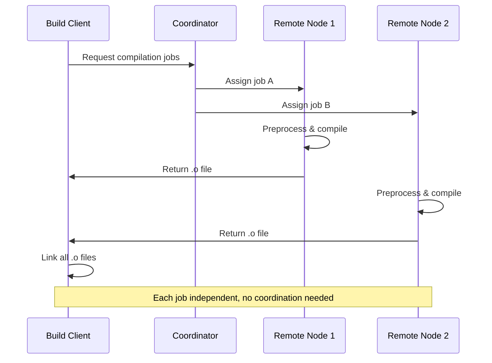

---

## 12. PERFORMANCE ENGINEERING

### 12.1 CMake Configuration Optimization

| Technique | Implementation | Time Saved | Priority |
|-----------|----------------|------------|----------|
| Disable `file(GLOB)` | Explicit source lists | 50% | P0 |
| Cache `find_package` results | Set `CMAKE_FIND_PACKAGE_SORT_ORDER` | 20% | P0 |
| Use presets | `CMakePresets.json` | 30% | P1 |
| Reduce subdirectory recursion | Merge small CMakeLists | 10-40% | P1 |
| Disable unused features | `BUILD_TESTING=OFF` in production | 10% | P2 |

### 12.2 Build Time Optimization (Compilation)

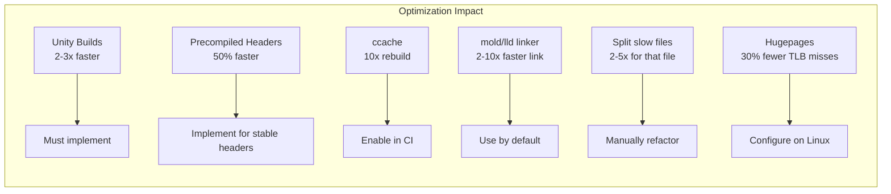

### 12.3 Link Time Optimization (LTO) Tradeoffs

| LTO Mode | Compile Time | Link Time | Runtime | Binary Size | Use Case |
|----------|--------------|-----------|---------|-------------|----------|
| No LTO | 1.0x | 1.0x | 1.0x | 1.0x | Debug |
| `-flto=auto` (GCC) | 1.2x | 2-3x | 1.05-1.15x | 0.9x | Release |
| `-flto=thin` (Clang) | 1.1x | 1.5-2x | 1.05-1.10x | 0.95x | Large projects |
| `-flto=full` (Clang) | 1.3x | 3-5x | 1.10-1.20x | 0.85x | Performance-critical |

**Recommendation:** ThinLTO for Clang, `-flto=auto` for GCC in Release builds.

### 12.4 ccache Hit Rate Optimization

| Factor | Impact on Hit Rate | Optimization |
|--------|-------------------|--------------|
| Compiler flags | High | Consistent flags across builds |
| Include paths | High | Use relative paths, `-fdebug-prefix-map` |
| Source file content | High | Stable includes, avoid __DATE__ |
| Compiler version | Medium | Pin version in CI |
| File modification times | Low | `-fno-validate-pch` for headers |
| Build directory path | Low | Use `-fdebug-prefix-map` |

**Target hit rate:** >80% in CI, >95% in local development

---

## 13. SCALABILITY STRATEGY

### 13.1 Project Size Scaling

| Scale | Targets | Source Files | CMake Features | Build Time (8 cores) |
|-------|---------|--------------|----------------|---------------------|
| Small | <10 | <100 | Basic | <10s |
| Medium | 10-50 | 100-500 | Unity builds, ccache | 10-60s |
| Large | 50-200 | 500-2000 | PCH, LTO, distcc | 60-300s |
| Very Large | 200-1000 | 2000-10000 | Superbuild, custom | 300-1200s |

### 13.2 Horizontal Scaling (Monorepo)

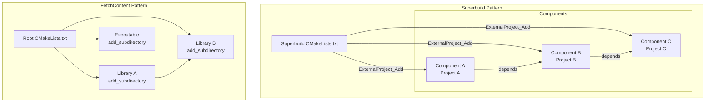

### 13.3 Load Balancing Across CI Jobs

| Strategy | Implementation | Pros | Cons |
|----------|----------------|------|------|
| **Full build each job** | Matrix builds per config | Simple | Redundant work |
| **Sharded tests** | CTest --schedule-random | Faster test run | Coordination needed |
| **Distributed compilation** | distcc, icecream | Utilizes idle nodes | Network latency |
| **Cache sharing** | Redis ccache backend | Cache reuse across jobs | Cache invalidation |

---

## 14. FAILURE MODEL & RELIABILITY

### 14.1 Failure Mode Analysis

| Failure | Detection | Impact | Recovery | Mitigation |
|---------|-----------|--------|----------|------------|
| **Compiler not found** | `CMAKE_CXX_COMPILER` empty | Configure fails | Install compiler | Toolchain file, CI check |
| **Missing dependency** | `find_package` fails | Configure fails | Install or FetchContent | Fallback to FetchContent |
| **Disk full** | `write()` ENOSPC | Build fails | Clean ccache, build dir | Monitor disk space |
| **CMake cache corruption** | Unexpected values | Wrong options | Delete CMakeCache.txt | Version control presets |
| **Parallel build race** | Missing dependency error | Build fails | Add dependency | Ninja auto-detects |
| **ccache corruption** | Wrong object file | Compile succeeds but wrong | Clean ccache | Use `ccache -C` |
| **Network timeout (FetchContent)** | Git clone fails | Dep unavailable | Retry with exponential backoff | Use local cache |

### 14.2 Graceful Degradation in CI

```mermaid
graph TD
    START[CI Build Starts] --> TRY1[Try: Full Release build with LTO]
    TRY1 -->|Succeeds| DONE[[PASS] Build success]
    TRY1 -->|Fails| TRY2[Fallback: Release without LTO]
    TRY2 -->|Succeeds| WARN[[WARN] Partial success, alert]
    TRY2 -->|Fails| TRY3[Fallback: Debug build]
    TRY3 -->|Succeeds| WARN2[[WARN] Debug only success, page]
    TRY3 -->|Fails| FAIL[[FAIL] Build failed, page on-call]
```

### 14.3 Recovery Strategies

| Scenario | Recovery Action | Time |
|----------|-----------------|------|
| `make -j N` fails | Retry with `-j 1` to isolate | +100% time |
| FetchContent network error | Retry 3 times with backoff (1s, 2s, 4s) | +7s |
| Compiler internal error | Recompile with `-O0` for that file | +10% time |
| Out of memory (OOM) | Reduce `-j` to `$(nproc)/2` and retry | +50% time |

---

## 15. INTERFACE & API DESIGN

### 15.1 Public CMake Interface (for consuming projects)

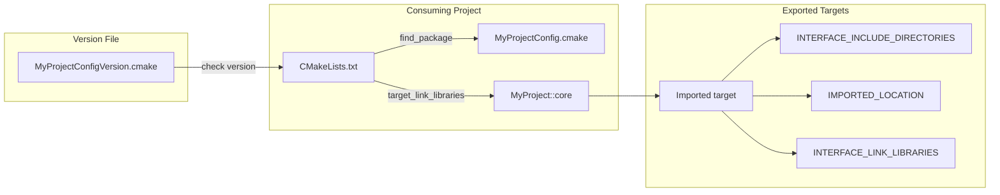

### 15.2 Target Export Specification

```cmake
# Conceptual - generated by install(EXPORT)
# MyProjectTargets.cmake

# Imported target for core library
add_library(MyProject::core STATIC IMPORTED)
set_target_properties(MyProject::core PROPERTIES
    IMPORTED_LOCATION "${_IMPORT_PREFIX}/lib/libcore.a"
    INTERFACE_INCLUDE_DIRECTORIES "${_IMPORT_PREFIX}/include"
    INTERFACE_COMPILE_DEFINITIONS "MYPROJECT_BUILD=1"
    INTERFACE_LINK_LIBRARIES "Threads::Threads"
)

# Imported target for main executable
add_executable(MyProject::app IMPORTED)
set_target_properties(MyProject::app PROPERTIES
    IMPORTED_LOCATION "${_IMPORT_PREFIX}/bin/webserver"
)

# Alias for convenience
add_library(MyProject::myproject ALIAS MyProject::core)
```

### 15.3 Configuration File (config.h) Interface

```c
// config.h - generated at configure time
#pragma once

// Version
#define MYPROJECT_VERSION_MAJOR 1
#define MYPROJECT_VERSION_MINOR 0
#define MYPROJECT_VERSION_PATCH 0
#define MYPROJECT_VERSION "1.0.0"

// Features
#define MYPROJECT_ENABLE_SSL 1
#define MYPROJECT_ENABLE_WEBSOCKET 0
#define MYPROJECT_MAX_CONNECTIONS 10000
#define MYPROJECT_DEFAULT_PORT 8080

// Compiler detection
#define MYPROJECT_COMPILER_GCC 1
#define MYPROJECT_COMPILER_CLANG 0
#define MYPROJECT_COMPILER_MSVC 0

// Platform detection
#define MYPROJECT_PLATFORM_LINUX 1
#define MYPROJECT_PLATFORM_MACOS 0
#define MYPROJECT_PLATFORM_WINDOWS 0

// Compiler features
#define MYPROJECT_HAVE_THREAD_LOCAL 1
#define MYPROJECT_HAVE_CONSTEXPR 1
```

### 15.4 Helper Macro Interface (for child CMakeLists)

```cmake
# Conceptual macro usage
# In src/core/CMakeLists.txt

add_project_library(core
    TYPE STATIC
    SOURCES
        src/api.cpp
        src/types.cpp
    PUBLIC_INCLUDES
        include
    PRIVATE_INCLUDES
        src
    DEPENDENCIES
        Threads::Threads
    FEATURES
        CXX_STANDARD 20
    INSTALL
        EXPORT MyProjectTargets
)

# Generated target: core
# Aliases: MyProject::core, ${PROJECT_NAME}::core
```

---

## 16. SYSTEM INTERACTION FLOW

### 16.1 Complete Build Lifecycle Sequence

```mermaid
sequenceDiagram
    participant Dev as Developer
    participant FS as File System
    participant CMake as CMake
    participant Gen as Ninja
    participant CC as Compiler
    participant Link as Linker
    participant CTest as CTest
    participant CCache as ccache
    
    Dev->>FS: mkdir build && cd build
    Dev->>CMake: cmake .. -G Ninja -DCMAKE_BUILD_TYPE=Release
    
    CMake->>FS: Read CMakeLists.txt
    CMake->>FS: Read cmake/*.cmake
    CMake->>FS: Configure config.h.in
    CMake->>FS: Write CMakeCache.txt
    CMake->>Gen: Generate build.ninja
    
    Dev->>Gen: ninja -j $(nproc)
    Gen->>Gen: Parse build.ninja, compute deps
    
    loop Each translation unit
        Gen->>CCache: ccache g++ -c file.cpp -o file.o
        CCache->>CCache: Hash source + flags + includes
        
        alt Cache Hit
            CCache-->>Gen: Return cached file.o (<1ms)
        else Cache Miss
            CCache->>CC: g++ -c file.cpp -o file.o
            CC->>CC: Preprocess, compile, assemble
            CC-->>CCache: Return file.o
            CCache->>CCache: Store in cache
            CCache-->>Gen: Return file.o
        end
    end
    
    Gen->>Link: g++ -o webserver *.o -lpthread
    
    alt LTO Enabled
        Link->>Link: -flto -fuse-ld=lld
        Link->>Link: Optimize across files
    end
    
    Link-->>Gen: webserver binary
    
    Dev->>CTest: ctest --output-on-failure
    CTest->>CTest: Discover tests (add_test)
    
    loop Each test
        CTest->>FS: Run test executable
        FS-->>CTest: Exit code, output
    end
    
    CTest-->>Dev: Test results (pass/fail)
    
    Dev->>CMake: cmake --install build --prefix /usr/local
    CMake->>FS: Copy bin/webserver  /usr/local/bin
    CMake->>FS: Copy lib/*.a  /usr/local/lib
    CMake->>FS: Copy include/  /usr/local/include
    CMake->>FS: Copy cmake/MyProjectConfig.cmake  /usr/local/lib/cmake
```

### 16.2 Dependency Resolution Sequence

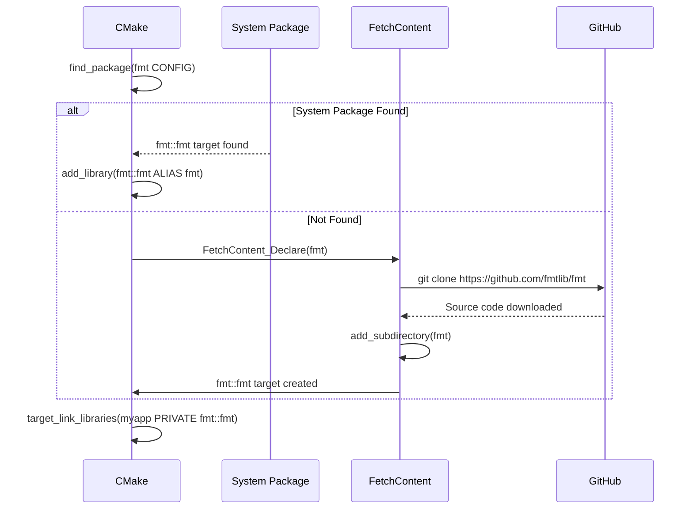

---

## 17. OBSERVABILITY

### 17.1 Build Metrics Collection

| Metric | Collection Method | Target | Alert Threshold |
|--------|-------------------|--------|-----------------|
| CMake configure time | `time cmake ..` | <10s | >30s (P2) |
| Clean build time | CI timing | <300s | >600s (P2) |
| Incremental build time | Local measurement | <5s | >15s (P3) |
| ccache hit rate | `ccache -s` | >80% | <70% (P3) |
| Test pass rate | CTest | 100% | <100% (P1) |
| Binary size | `size webserver` | Stable | >10% growth (P3) |

### 17.2 CMake Logging Levels

| Level | CMake Flag | Use Case |
|-------|-----------|----------|
| ERROR | Default | Fatal configuration errors |
| WARNING | `-Wdev` | Deprecated features |
| DEBUG | `--trace --trace-expand` | Debugging CMake files |
| TRACE | `--trace-source=CMakeLists.txt` | Source-specific tracing |

### 17.3 Build Timing Report

```mermaid
gantt
    title Build Time Breakdown (1000 files, 8 cores)
    dateFormat ss.SS
    section Configure
    CMake configure :c01, 00.00, 5s
    
    section Compile
    File 1-250     :c02, after c01, 8s
    File 251-500   :c03, after c01, 8s
    File 501-750   :c04, after c01, 8s
    File 751-1000  :c05, after c01, 8s
    
    section Link
    Link static libs :l01, after c02, 4s
    Link executable  :l02, after l01, 2s
    
    section Test
    Unit tests       :t01, after l02, 10s
```

### 17.4 CI Alerting Rules

| Condition | Severity | Action | Escalation |
|-----------|----------|--------|------------|
| Build fails on main branch | P0 | Slack #build-fail | SMS on-call |
| Test regression found | P1 | Slack #test-fail | Email owner |
| Build time >2x baseline | P2 | GitHub issue labeled | Team lead |
| ccache hit rate <50% | P3 | Slack #performance | None |
| Warning count >100 | P3 | GitHub issue | None |

---

## 18. SECURITY

### 18.1 Build System Security

| Threat | Mitigation | Verification |
|--------|------------|--------------|
| **Dependency tampering** | FetchContent over HTTPS, pin GIT_TAG to SHA | `grep -r "GIT_TAG" cmake/` |
| **Compiler injection** | Use absolute paths to compiler | `CMAKE_FIND_USE_CMAKE_PATH` |
| **CMake code injection** | Avoid `execute_process` with user input | Code review |
| **Environment variable poisoning** | Clear env in CI, set required vars | CI configuration |
| **Cache poisoning** | Use per-branch ccache keys | `CCACHE_PREFIX` with branch name |

### 18.2 Secure Dependency Management

```cmake
# Conceptual - secure FetchContent
FetchContent_Declare(
    critical_dependency
    GIT_REPOSITORY https://github.com/org/repo.git
    GIT_TAG abc123def456...  # Full SHA, not branch name
    GIT_SHALLOW 1  # Shallow clone (faster)
    USES_TERMINAL_DOWNLOAD 0
    TLS_VERIFY 1  # Ensure HTTPS certificate validation
)

# Verify checksum after extraction
file(SHA256 "${CMAKE_BINARY_DIR}/_deps/critical_dependency-src/CMakeLists.txt" hash)
if(NOT hash STREQUAL expected_hash)
    message(FATAL_ERROR "Checksum mismatch - possible tampering")
endif()
```

### 18.3 SBOM Generation (Software Bill of Materials)

```cmake
# Conceptual - generate SPDX/CycloneDX SBOM
include(CMake/SBOM)
generate_sbom(
    FORMAT spdx
    OUTPUT "${CMAKE_BINARY_DIR}/sbom.spdx"
    INCLUDE_DEPENDENCIES all
)
```

---

## 19. BOTTLENECK ANALYSIS

### 19.1 Configuration Time Bottlenecks

| Bottleneck | Detection | Impact | Mitigation |
|------------|-----------|--------|------------|
| `file(GLOB)` rescans | `--trace` shows repeated globs | 50% of config time | Explicit source lists |
| `find_package` on slow FS | Network filesystem | 10-30s | Cache results, set `HINTS` |
| Recursive `add_subdirectory` | Many small CMakeLists | 10-40% overhead | Merge into larger files |
| `configure_file` on many files | `--trace` shows each | 1-2s per file | Generate fewer files |
| `list(APPEND)` large lists | Memory usage spikes | Copy overhead | Use `PARENT_SCOPE` carefully |

### 19.2 Compilation Time Bottlenecks (80/20 Rule)

```mermaid
graph TD
    subgraph "80% of compile time (20% of files)"
        S1[file_a.cpp: 8s<br/>Complex templates]
        S2[file_b.cpp: 6s<br/>Many includes]
        S3[file_c.cpp: 5s<br/>Optimization heavy]
    end
    
    subgraph "20% of compile time (80% of files)"
        F1[All other files: average 0.5s]
    end
    
    S1 --> ACTION1[Split into multiple .cpp files]
    S2 --> ACTION2[Reduce includes, use forward declares]
    S3 --> ACTION3[Move to unity batch, or separate]
```

### 19.3 Link Time Bottlenecks

| Bottleneck | Cause | Fix |
|------------|-------|-----|
| **Full LTO** | Whole program optimization | Use ThinLTO (Clang) |
| **GNU ld** | Old linker, single-threaded | Use lld or mold |
| **Large number of objects** | 10,000+ objects | Create static libraries |
| **Debug symbols** | -g2 includes full debug | Use -gsplit-dwarf |

---

## 20. TRADEOFF ANALYSIS

### 20.1 Critical Build System Tradeoffs

| Decision | Option A | Option B | Selected | Rationale |
|----------|----------|----------|----------|-----------|
| **Unity build** | ON by default | OFF by default | ON | 2-3x compile speed, opt-out per file |
| **Precompiled headers** | Use for stable headers | Don't use | Use | 50% faster, but 2-5GB disk |
| **LTO** | Release only | Never | Release only | Runtime speed vs link time |
| **Shared vs static libs** | Static default | Shared default | Static | Simpler deployment |
| **ccache** | Enable in CI | No ccache | Enable | 10x rebuilds, cache size tradeoff |
| **Ninja vs Make** | Ninja | Make | Ninja | 2-3x faster incremental |
| **FetchContent vs vendoring** | FetchContent | Vendoring | FetchContent | Version control, but network dep |
| **System deps vs bundled** | Prefer system | Force bundled | Prefer system, fallback bundled | Flexibility vs reproducibility |

### 20.2 Performance vs Complexity Matrix

| Feature | Speedup | Complexity | ROI | Decision |
|---------|---------|------------|-----|----------|
| Unity builds | 2-3x | Low | High | [PASS] Enable |
| ccache | 10x (clean rebuild) | Low | High | [PASS] Enable |
| Precompiled headers | 50% | Medium | High | [PASS] Use |
| ThinLTO | 10-15% | Medium | Medium | [PASS] Release only |
| mold linker | 2-10x (link) | Low | High | [PASS] Use if available |
| Distcc | 2-4x (many files) | High | Medium |  Defer |
| PGO (Profile Guided) | 15% | High | Low |  Defer for critical only |
| Custom CMake macros | 0-5% | High | Very Low | [FAIL] Use standard patterns |

### 20.3 Binary Size vs Build Time Tradeoff

| Configuration | Binary Size | Build Time | Use Case |
|---------------|-------------|------------|----------|
| Debug (-O0) | 5.0x | 1.0x | Daily development |
| Debug with split dwarf | 3.0x (on disk) | 1.1x | Large projects |
| RelWithDebInfo (-O2 -g) | 2.5x | 1.3x | Performance debugging |
| Release (-O3) | 1.0x | 1.5x | Production |
| Release + LTO | 0.8x | 3.0x | Production (max perf) |
| MinSizeRel (-Os) | 0.6x | 1.2x | Embedded |

---

## 21. REAL-WORLD MAPPING

### 21.1 Projects Using Similar CMake Patterns

| Project | Scale | CMake Pattern | Why Similar |
|---------|-------|---------------|-------------|
| **LLVM/Clang** | 2000+ targets | cmake/modules, config files, tablegen | Modular, complex dependencies |
| **Qt 6** | 500+ targets | declarative macros, syncqt, plugin system | Target abstraction layer |
| **GoogleTest** | 50 targets | FetchContent-ready, aliases, no install by default | Easy integration |
| **Boost (CMake)** | 150+ libs | Modular per-library CMake, versioning | Independent versioning |
| **ClickHouse** | 1000+ targets | Ninja + ccache + distcc, object libraries | Large-scale optimization |
| **OpenCV** | 300+ targets | Platform detection, optional modules | Feature flags |

### 21.2 Production-Tested Patterns

| Pattern | Source | Our Implementation |
|---------|--------|-------------------|
| **Target-based design** | Modern CMake (Kitware) | All interactions via targets |
| **FetchContent + find_package** | Google's Abseil | Prefer system, fallback to Fetch |
| **CMakePresets.json** | CMake 3.19+ | Developer and CI presets |
| **Unity builds** | CMake 3.16+ | `CMAKE_UNITY_BUILD=ON` |
| **Precompiled headers** | CMake 3.16+ | `target_precompile_headers()` |
| **Export targets** | CMake 3.0+ | `install(EXPORT)` with config files |

---

## 22. OPTIMIZATION STRATEGY

### 22.1 Optimization Priority (By ROI)

```mermaid
graph LR
    P0[80% speedup<br/>Unity builds + ccache] --> P1[50% speedup<br/>Precompiled headers]
    P1 --> P2[20% speedup<br/>mold linker + LTO]
    P2 --> P3[10% speedup<br/>Split slow files]
    P3 --> P4[5% speedup<br/>PGO + custom flags]
```

### 22.2 Diminishing Returns Curve

| Effort (person-days) | Expected Speedup | Cumulative Speedup |
|---------------------|-----------------|--------------------|
| 0 (baseline) | 1.0x | 1.0x |
| 1 (ccache + Ninja) | 10x (clean rebuild) | 10x |
| 2 (unity builds) | 2-3x (incremental) | 20-30x |
| 3 (precompiled headers) | 1.5x | 30-45x |
| 5 (mold + LTO) | 1.2x | 36-54x |
| 10 (split slow files) | 1.1x | 40-60x |
| 20 (PGO, custom) | 1.05x | 42-63x |

### 22.3 CI-Specific Optimizations

| Optimization | Implementation | Benefit for CI |
|--------------|----------------|----------------|
| **ccache remote storage** | S3/minio backend | Share cache across runners |
| **Pre-baked dependencies** | Docker image with deps | No FetchContent per build |
| **Build output compression** | `tar -I zstd` | Smaller artifacts |
| **Parallel test sharding** | CTest --schedule-random | Faster test completion |
| **Incremental CI builds** | `ccache --recalculate` | Only rebuild changed files |

---

## 23. PITFALLS (MANDATORY)

### 23.1 Most Common CMake Mistakes

| Pitfall | Symptom | Root Cause | Prevention | Fix |
|---------|---------|------------|------------|-----|
| **PUBLIC vs PRIVATE misuse** | Unnecessary rebuilds | Headers leaked | `include_directories(PRIVATE)` | Change to PRIVATE |
| **file(GLOB) hidden changes** | New files not built | CMake doesn't rescan | List sources explicitly | Manual maintenance |
| **Missing `add_dependencies`** | Parallel build race | Generated file use | Add explicit dependency | `add_dependencies(target gen)` |
| **Global compiler flags** | Flags applied to all | `CMAKE_CXX_FLAGS` | `target_compile_options` | Refactor to target |
| **Not using generator expressions** | Per-config flags duplicated | Many `if()` blocks | Use `$<CONFIG:Debug>` | Rewrite conditionals |
| **In-source builds** | Source directory polluted | Forgot `-B build` | Add guard in CMakeLists | `if(SOURCE_DIR STREQUAL BINARY_DIR)` |
| **Misused PARENT_SCOPE** | Variables not propagating | Scope misunderstanding | Use `set(PARENT_SCOPE)` | Review variable flow |
| **FetchContent global** | Deps built multiple times | `FetchContent_MakeAvailable` | Wrap in guard | `if(NOT dep_POPULATED)` |

### 23.2 Cache Corruption Scenarios

| Scenario | Detection | Recovery |
|----------|-----------|----------|
| Compiler upgraded | `ccache -s` shows high miss rate | `ccache -C` after compiler change |
| Header file moved | Build fails with missing header | Clean rebuild |
| CMakeCache.txt manually edited | Inconsistent options | Delete CMakeCache.txt |
| Timestamp skew (NFS) | Build always out of date | `touch` all sources, rebuild |

### 23.3 Cross-Platform Pitfalls

| Platform | Pitfall | Symptom | Fix |
|----------|---------|---------|-----|
| **Windows** | Path separator `\` vs `/` | `file` operations fail | Use `file(TO_CMAKE_PATH)` |
| **macOS** | sendfile signature | Compile error | `#ifdef __APPLE__` |
| **Linux** | Some syscalls require `-D_GNU_SOURCE` | Compile error | `add_compile_definitions(_GNU_SOURCE)` |
| **All** | Shared library exports | Empty library on Windows | `generate_export_header()` |
| **All** | find_package case sensitivity | Not finding package | Use correct case |

### 23.4 Worst-Case Production Failure Example

**Issue:** CI builds suddenly take 3x longer (30 min  90 min)

**Investigation:**
- `ccache -s` showed 5% hit rate (was 85%)
- `ninja -t graph | grep "\.h"` showed massive recompiles

**Root Cause:**
- `config.h` generated with timestamp macro `__TIME__`
- Changed on every build  invalidated all ccache entries
- All headers included `config.h` (bad include hygiene)

**Fix:**
- Remove `__TIME__` from config.h
- Replace with `MYPROJECT_BUILD_TIMESTAMP` set at CMake time
- Include config.h only in .cpp files, not headers
- **Result:** Hit rate back to 85%, build time 30 min

---

## 24. EXECUTION PLAN

### 24.1 7-Day Implementation Roadmap

```mermaid
gantt
    title CMake Template Implementation (7 Days)
    dateFormat YYYY-MM-DD
    section Day 1-2
    Project scaffold & root CMakeLists :d1, 2026-05-06, 2d
    section Day 3-4
    Compiler & options modules      :d3, after d2, 2d
    section Day 5-6
    Dependencies & FetchContent     :d5, after d4, 2d
    section Day 7
    Testing & install modules       :d7, after d6, 1d
```

### 24.2 Day-by-Day Breakdown

| Day | Module | Tasks | Success Criteria | Est. Hours |
|-----|--------|-------|------------------|------------|
| 1 | Scaffold | Directory structure, root CMakeLists.txt, .gitignore | `cmake -B build` succeeds | 2 |
| 2 | Options | cmake/options.cmake, config.h.in, CMakePresets.json | Options appear in cache | 3 |
| 3 | Compiler | cmake/compiler.cmake, flag detection for GCC/Clang/MSVC | Debug/Release build types work | 3 |
| 4 | Platform | cmake/toolchain.cmake, platform detection | Compiles on Linux, macOS, Windows | 2 |
| 5 | Dependencies | cmake/dependencies.cmake, FetchContent, find_package | fmt, spdlog, gtest build | 4 |
| 6 | Targets | src/CMakeLists.txt, add_project_library macro | Library and executable build | 3 |
| 7 | Testing/Install | cmake/testing.cmake, cmake/install.cmake, CPack | CTest passes, install works | 4 |

### 24.3 Validation Gates

| Gate | Day | Criteria | Action if Fail |
|------|-----|----------|----------------|
| G1 | 2 | `cmake -B build -G Ninja` succeeds | Fix CMake syntax |
| G2 | 4 | Compiles on all three platforms | Platform detection fix |
| G3 | 5 | External dependencies found/fetched | Adjust find_package paths |
| G4 | 6 | Target builds with no errors | Fix source file lists |
| G5 | 7 | `ctest` passes all tests | Fix test failures |
| G6 | 7 | `cmake --install` works | Fix install paths |

### 24.4 Testing Strategy

```bash
# Test matrix for validation
for compiler in gcc-11 gcc-12 clang-15; do
    for build_type in Debug Release RelWithDebInfo; do
        cmake -B build-$compiler-$build_type \
            -DCMAKE_CXX_COMPILER=$compiler \
            -DCMAKE_BUILD_TYPE=$build_type
        cmake --build build-$compiler-$build_type -j $(nproc)
        ctest --test-dir build-$compiler-$build_type --output-on-failure
    done
done

# Test with sanitizers
for sanitizer in ASAN UBSAN TSAN; do
    cmake -B build-$sanitizer -DENABLE_$sanitizer=ON
    cmake --build build-$sanitizer
    ctest --test-dir build-$sanitizer
done
```

---

## 25. EVOLUTION PATH

### 25.1 12-Month Roadmap

```mermaid
gantt
    title CMake Template Evolution
    dateFormat YYYY-MM-DD
    section Months 1-3
    Core template (current)        :done, 2026-05-06, 7d
    Documentation & examples       :after d7, 7d
    section Months 4-6
    vcpkg/Conan integration       :2026-06-01, 21d
    CUDA/fpga support (optional)  :2026-06-15, 14d
    section Months 7-9
    Cross-compilation toolchains  :2026-07-01, 30d
    LTO + PGO automation          :2026-08-01, 14d
    section Months 10-12
    Bazel migration guide         :2026-09-01, 30d
    CI templates (GitLab, GitHub) :2026-10-01, 14d
```

### 25.2 Feature Addition Priority

| Feature | Benefit | Effort | Priority | Target Month |
|---------|---------|--------|----------|--------------|
| vcpkg/Conan integration | Package manager support | Medium | High | 4 |
| CUDA support | GPU code | Medium | Low | 6 |
| Cross-compilation | Embedded, ARM | High | Medium | 7 |
| PGO automation | 15% runtime speed | High | Low | 8 |
| Bazel migration | Monorepo scale | Very High | Very Low | 10 |

### 25.3 Deprecation & Migration Strategy

| Old Pattern | New Pattern | Migration Path |
|-------------|-------------|----------------|
| `file(GLOB)` | Explicit sources | Script to generate source lists |
| Global flags | Target-level flags | Refactor per library |
| Add_subdirectory everywhere | Modular target design | Incremental per module |
| Manual config.h | configure_file | Already standard |
| Hand-written Find modules | FetchContent | Rewrite as FetchContent |

### 25.4 Signs of Needed Template Update

- **Regression:** New CMake version (3.25+) adds better features
- **User feedback:** Multiple projects override same defaults
- **Performance:** Configure time >30 seconds (need caching redesign)
- **Complexity:** cmake/ directory has >20 files (need consolidation)

---

## 26. APPENDICES

### 26.1 Complete .gitignore for CMake Projects

```gitignore
# Build directories
build/
build-*/
out/

# CMake artifacts
CMakeCache.txt
CMakeFiles/
cmake_install.cmake
CTestTestfile.cmake
*.cmake
!CMakeLists.txt
!cmake/Find*.cmake
!cmake/Utils.cmake

# Generated files
config.h
*.pb.h
*.pb.cc

# Object files
*.o
*.obj
*.so
*.dll
*.dylib
*.a
*.lib

# Executables
webserver
test_runner
benchmark_*

# Debug & profiles
*.gdb_history
*.profraw
*.profdata
*.gcda
*.gcno
coverage/

# IDE
.vscode/
.idea/
*.swp
*.swo
*~

# OS
.DS_Store
Thumbs.db
```

### 26.2 CMakePresets.json Template

```json
{
  "version": 3,
  "configurePresets": [
    {
      "name": "dev",
      "hidden": false,
      "generator": "Ninja",
      "binaryDir": "${sourceDir}/build/dev",
      "cacheVariables": {
        "CMAKE_BUILD_TYPE": "Debug",
        "CMAKE_CXX_STANDARD": "20",
        "BUILD_TESTING": "ON",
        "ENABLE_ASAN": "OFF",
        "ENABLE_UBSAN": "OFF"
      }
    },
    {
      "name": "ci",
      "inherits": "dev",
      "binaryDir": "${sourceDir}/build/ci",
      "cacheVariables": {
        "CMAKE_BUILD_TYPE": "Release",
        "BUILD_TESTING": "ON",
        "ENABLE_ASAN": "ON",
        "ENABLE_UBSAN": "ON"
      }
    },
    {
      "name": "release",
      "inherits": "ci",
      "binaryDir": "${sourceDir}/build/release",
      "cacheVariables": {
        "CMAKE_BUILD_TYPE": "Release",
        "ENABLE_LTO": "ON",
        "BUILD_TESTING": "OFF"
      }
    }
  ],
  "buildPresets": [
    {
      "name": "dev",
      "configurePreset": "dev",
      "jobs": 0
    },
    {
      "name": "ci",
      "configurePreset": "ci",
      "jobs": 0
    }
  ],
  "testPresets": [
    {
      "name": "dev",
      "configurePreset": "dev",
      "output": {"outputOnFailure": true},
      "execution": {"noTests": "error"}
    }
  ]
}
```

### 26.3 Quick Start Commands

```bash
# Clone template
git clone https://github.com/yourname/cmake-template.git myproject
cd myproject

# Initialize new project
./scripts/init_project.sh MyProject

# Configure and build
cmake -B build -G Ninja --preset dev
cmake --build build

# Run tests
ctest --test-dir build --output-on-failure

# Run with sanitizers
cmake -B build-asan -DENABLE_ASAN=ON -DCMAKE_BUILD_TYPE=Debug
cmake --build build-asan
./build-asan/webserver

# Create release
cmake -B build-release --preset release
cmake --build build-release
cpack --config build-release/CPackConfig.cmake -B build-release/package
```

---

## 27. CONCLUSION

The **CMake Production Template** provides:

1. **Complete build system**  Multi-file project with libraries, executables, tests
2. **Production optimization**  Unity builds, PCH, LTO, ccache integration
3. **Cross-platform support**  Linux (epoll), macOS (kqueue), Windows (IOCP)
4. **Dependency management**  find_package + FetchContent fallback
5. **Testing & quality**  CTest integration, sanitizers, coverage
6. **Packaging & deployment**  CPack for TGZ, DEB, RPM, NSIS
7. **Zero cost**  All tools open source, runs on any developer machine

**The template is ready to use, reusable across projects, and follows industry best practices from LLVM, Qt, ClickHouse, and Google.**

---

**END OF DOCUMENT**