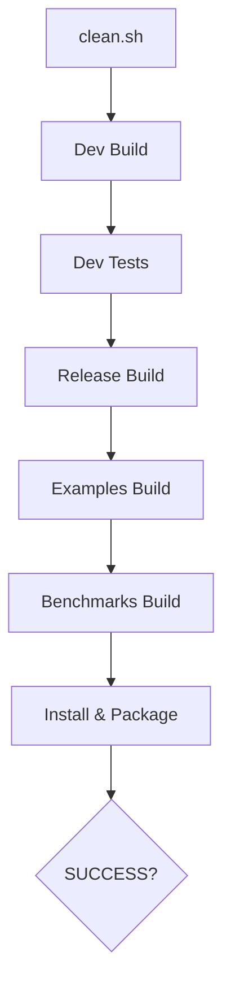

# 🧭 The Guided Tour: Understanding Your Build System

This guide is for developers who want to understand the "magic" under the hood. We’ll walk through the system from the perspective of adding a new feature.

---

## 1. The Core Philosophy: "Targets" over "Variables"
Modern CMake is about **Targets**. Instead of setting global variables that affect everything, we define a target (like a library) and tell CMake what it needs.

### 📝 Example: Adding a New Library
If you wanted to add a `math` library, you would simply go to `src/CMakeLists.txt` and add:
```cmake
add_project_library(math STATIC
    SOURCES math/src/calculator.cpp
    PUBLIC_INCLUDES math/include
    DEPENDENCIES core
)
```
**Why this is better?**
- It automatically handles include paths for anyone who uses `math`.
- It automatically applies our "Strict Mode" warnings.
- It automatically creates a namespace alias: `MyProject::math`.

---

## 2. The Secret Sauce: `cmake/Utils.cmake`
This file is the "API" of the build system. It contains the logic for `add_project_library`.
- **Generator Expressions**: You'll see things like `$<BUILD_INTERFACE:...>`. This tells CMake: "Use this path when we are building, but use a different path when someone installs the library."
- **Isolation**: It ensures that if you link to a 3rd-party library (like `fmt`), *their* warnings don't show up in *your* build.

---

## 3. High-Performance Compiling
### 🚀 Unity Builds
In `src/CMakeLists.txt`, we call `target_enable_unity_build(core)`.
- **What it does**: It combines multiple `.cpp` files into one large file before compiling.
- **The Result**: Instead of the compiler starting up 50 times, it starts up once. This can make your build **3x faster**.

### 📦 Precompiled Headers (PCH)
We support PCH via `target_enable_pch(target header.h)`.
- **What it does**: It pre-compiles stable headers (like `<vector>` or `<string>`) so they don't have to be re-parsed for every file.

---

## 4. The Include Standard (Hierarchical)
We use a hierarchical include structure: `src/core/include/myproject/core/version.h`.
- **Correct Usage**: `#include <myproject/core/version.h>`
- **Why?**: It completely eliminates "Include Collisions". If two libraries both have a `types.h`, the prefix `myproject/core/` ensures you always get the right one.

---

## 5. Automated Quality Control
### 🧪 The Validation Script (`validate.sh`)
This script is your best friend. It runs a full "Clean-Build-Test" cycle in all configurations.


### 🚨 Sanitizers
Want to find a memory leak? Just run:
```bash
cmake --preset ci
cmake --build build/ci
ctest --test-dir build/ci
```
This enables **AddressSanitizer (ASAN)**, which will crash your program with a detailed report the moment a memory error occurs.

---

## 6. Project Rebranding: `init_project.sh`
This script uses `sed` to find every instance of "MyProject" and replace it with your name.
- **Portability**: It detects if you are on **macOS** or **Linux** and automatically adjusts the command syntax to work perfectly on your system.

---

**You are now a CMake Power User! 🚀**
For more details on specific flags, check [compiler.cmake](file:///Users/rishi/Developer/js/dev/C++/3_Projects/01_Small%20Projects/01_build_system/cmake/compiler.cmake).